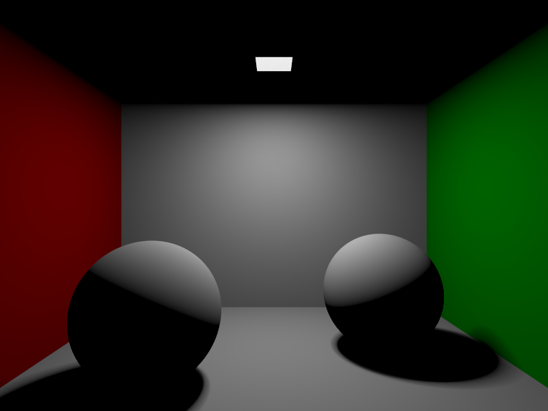
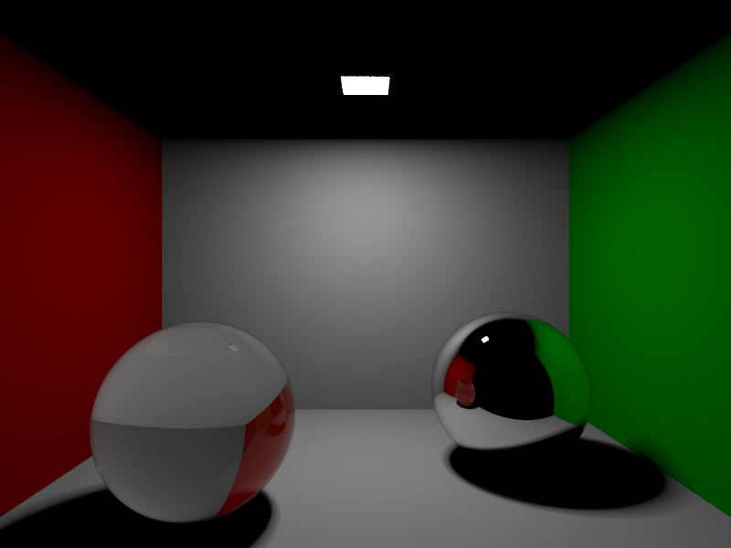

# Neon - Raytracing on the CPU

## Main Features

- Implements the Whitted Algorithm for integrating the scene
- Use of octrees to speed up image rendering
- Visualize the image being rendered - Uses OpenGL to show the image as it is being created
- Export image to png
- Multi-threaded rendering using a thread pool
- Scene description using a `.toml` file

## TODO
- [ ] Load meshes to the renderer

## How to build
Clone the repository then do:

```
mkdir build
cd build
cmake .. && cmake --build .
```

This will create a neon executable with the name neon on the build directory

Requires OpenGL to be installed on the system and for CMake to be able to find it with the command `find_package(OpenGL)`

## Examples




